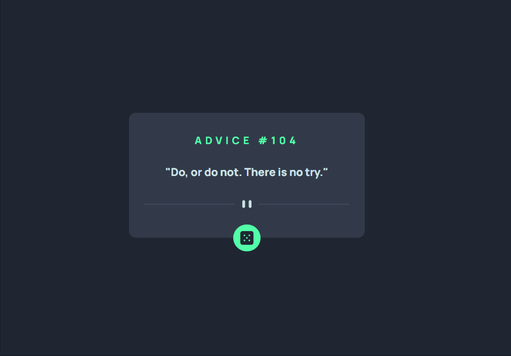

# Advice-Generator
Este desafio faz parte do curso Dev em Dobro, e também pode ser encontrado na pagina do Frontend Mentor.   
[CLIQUE AQUI](https://www.frontendmentor.io/challenges/advice-generator-app-QdUG-13db) para conferir o desafio.

## Do que se trata esse desafio?
Trata-se de um gerador de conselhos, utilizando a API Advice Slip.  
A cada clique no botão, o usuário tem acesso a um conselho aleatório.

## Habilidades desenvolvidas:
- Uso de flexbox para ajustes dos elementos na tela.
- Uso e manipulação dos elementos no JavaScript através do DOM.
- Uso de funções assíncronas, eventos e interação com API. 

## Linguagens Utilizadas:
- HTML 

- CSS  

- JAVASCRIPT  
          

## Veja como ficou:

### Desktop:
  

  
  Para ver a página, [clique aqui!](https://jessica-os.github.io/Advice-Generator/)
